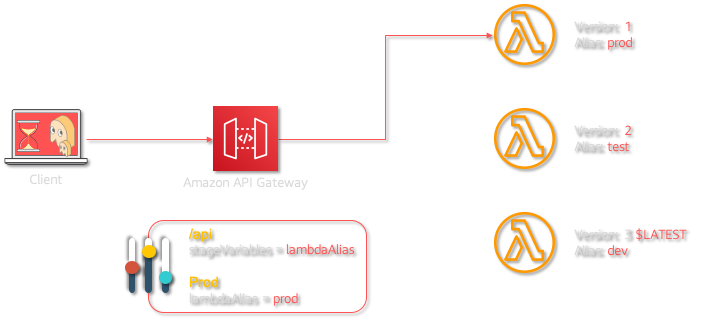

# API Best Practices: Highly Performant Design - API Gateway | Stage Variables with Lambda Alias

Mystique Unicorn App is a building new application based on microservice architectural pattern. The developers intend to create several deployment environments such as `dev`, `test` or `prod` to maintain the pace of development.

The dev's are interested in having the ability to change the backend without any changes to the front-end. For example, The users should be sent to a different database from the Lambda function or trigger a completely different Lambda function or may get access some specific features in the app without having to do anything from their side.

Can you help them do that in Amazon API Gateway & AWS Lambda?

## 🎯Solutions

We can do this by using API Gateway stage variables ([ReST API][8] & [HTTP API][9]) and Lambda function [alias](https://docs.aws.amazon.com/lambda/latest/dg/configuration-aliases.html) without creating environment-wise redundant Lambda functions. In short, different Lambda alias, like `TEST` and `PROD` can be used as two different deployment targets for the Lambda function. When it comes to API Gateway, the [AWS Best Practice][10] here is to use different accounts or independant deployments of APIs for multiple environment like `dev`, `test` or `prod`.



In this article, we will build an architecture, similar to the one shown above - A simple API using API Gateway which will trigger a Lambda function. We will have an stageVariable `lambdaAlias` and lets assume it is going to be an `prod` environment. The lambda will have multiple alias point at different stage of development. `prod` pointing to the most stable version and `dev` pointing to the bleeding edlge version.

Depending on the `lambdaAlias` value in API Gateway and Lambda `alias` pointer, the response of the API will be different. The stacks are generated using [AWS Cloud Development Kit (CDK)][102]. The architecture has been designed in a modular way so that we c``an build them individually and integrate them together. The prerequisites to build this architecture are listed below

1.  ## 🧰 Prerequisites

    This demo, instructions, scripts and cloudformation template is designed to be run in `us-east-1`. With few modifications you can try it out in other regions as well(_Not covered here_).

    - 🛠 AWS CLI Installed & Configured - [Get help here](https://youtu.be/TPyyfmQte0U)
    - 🛠 AWS CDK Installed & Configured - [Get help here](https://www.youtube.com/watch?v=MKwxpszw0Rc)
    - 🛠 Python Packages, _Change the below commands to suit your OS, the following is written for amzn linux 2_
      - Python3 - `yum install -y python3`
      - Python Pip - `yum install -y python-pip`
      - Virtualenv - `pip3 install virtualenv`

1.  ## ⚙️ Setting up the environment

    - Get the application code

      ```bash
      git clone https://github.com/miztiik/api-with-stage-variables
      cd api-with-stage-variables
      ```

1.  ## 🚀 Prepare the dev environment to run AWS CDK

    We will cdk to be installed to make our deployments easier. Lets go ahead and install the necessary components.

    ```bash
    # If you DONT have cdk installed
    npm install -g aws-cdk

    # Make sure you in root directory
    python3 -m venv .env
    source .env/bin/activate
    pip3 install -r requirements.txt
    ```

    The very first time you deploy an AWS CDK app into an environment _(account/region)_, you’ll need to install a `bootstrap stack`, Otherwise just go ahead and deploy using `cdk deploy`.

    ```bash
    cdk bootstrap
    cdk ls
    # Follow on screen prompts
    ```

    You should see an output of the available stacks,

    ```bash
    anti-pattern-api
    well-architected-api
    ```

1.  ## 🚀 Deploying the application

    Let us walk through each of the stacks,

    - **Stack: anti-pattern-api**
      We are going to deploy a simple api running as a lambda function. This API is deployed as public endpoint without any `stageVariables` or lambda `alias`. When the api is invoked, The backend returns a greeting message with along an timestamp

      Initiate the deployment with the following command,

      ```bash
      cdk deploy anti-pattern-api
      ```

      _Expected output:_
      The `AntiPatternApiUrl` can be found in the outputs section of the stack,

      ```bash
      $ ANTI_PATTERN_API_URL="https://c4o9bm2qwj.execute-api.us-east-1.amazonaws.com/prod/anti-pattern-api/greeter"
      $ curl ${ANTI_PATTERN_API_URL}
      {
        "message": "Hello from Miztiikal World, How is it going?",
        "api_stage": "NO-STAGE-VARIABLE-DEFINED",
        "lambda_version": "$LATEST",
        "ts": "2020-08-26 17:07:27.707655"
      }
      ```

      Here you can observe that lambda version is pointing to the `$LATEST` alias.

    - **Stack: well-architected-api**

      This stack:_well-architected-api_ is very much similar to the previous stack. In addition to that, We will also add an stage variable called `lambdaAlias` and set the value of that variable to `prod`. In addition to that, We will enable version and alias in greeter lambda function. The stack should create two aliases:

      - `dev` - Pointing to the `$LATEST` version
      - `prod` - Pointing to a unique idempotent version

      Initiate the deployment with the following command,

      ```bash
      cdk deploy well-architected-api
      ```

      Check the `Outputs` section of the stack to access the `WellArchitectedApiUrl`

1.  ## 🔬 Testing the solution

    We can use a tool like `curl` or `Postman` to query the urls. The _Outputs_ section of the respective stacks has the required information on the urls.

    ```bash
    $ WELL_ARCHICTED_API_URL="https://r4e3y68p11.execute-api.us-east-1.amazonaws.com/prod/well-architected-api/greeter"
    $ curl ${WELL_ARCHICTED_API_URL}
    {
      "message": "Hello from Miztiikal World, How is it going?",
      "api_stage": "prod",
      "lambda_version": "38",
      "ts": "2020-08-26 13:03:19.810150"
    }
    ```

    We can observe that the api is invoking a specific version of lambda: `38` to be specific. Your `lambda_version` number could be different from what is shown here. Let us make some changes to the lambda code and then test again.

    - Navigate to the `greeter_fn_well-architected-api` in the Lambda console
    - From **Qualifiers** > Select **Version** > Select **\$LATEST**
    - To make it easier to edit the code, without breaking anything else, Lets update the `greetings_msg` variable. This should be around line _46_.

      Change from this,

      ```bash
      greetings_msg = "Hello from Miztiikal World, How is it going?"
      # greetings_msg = "Hello from Modernized Miztiikal World, How is it going?"
      ```

      to this,

      ```bash
      # greetings_msg = "Hello from Miztiikal World, How is it going?"
      greetings_msg = "Hello from Modernized Miztiikal World, How is it going?"
      ```

    - **Save** the function
    - From **Actions** > Select **Publish new version** > Write a friendly description and Choose **Publish**
      and point the alias to the new version

    Now we have our shiny new update function, let us promote `prod` alias to this updated version

    - From **Qualifiers** > Select **Alias** (_If you see versions, then choose **Alias**_) > Select **prod**
    - Scroll to _Alias Configuration_ > Choose **Edit**
    - Select the newest version(_for example `39`_) > Select **Save**
      - Leave _Weighted Alias_ at defaults

    ```bash
    $ curl ${WELL_ARCHICTED_API_URL}
    {
      "message": "Hello from Modernized Miztiikal World, How is it going?",
      "api_stage": "prod",
      "lambda_version": "39",
      "ts": "2020-08-27 13:03:19.810150"
    }
    ```

    You should be able observe that the `lambda_version` is updated with the newer version and also the `message` is changed.

    _Additional Learnings:_ You can check the logs in cloudwatch for more information or increase the logging level of the lambda functions by changing the environment variable from `INFO` to `DEBUG`

1.  ## 📒 Conclusion

    Here we have demonstrated how to use API Gateway stage variables and lambda alias to release changes to your backend without impacting your frontend. Here are some **AWS Lambda Versioning Strategies** that can used in your projects,

    - Do not use an unqualified ARN or `$LATEST` in production
    - Never call specific versions in production front-ends. Use an unique alias for each production release
      - `prod202008` or `prodDV1`
    - Retire older unused endpoints by denying their access via AWS IAM Role policy.

      - For example, _DENY_ access to older alias

      ```json
      {
        "Statement": [
          {
            "Effect": "Deny",
            "Action": ["lambda:invokefunction"],
            "Resource": [
              "arn:aws:lambda:aws-region:acct-id:function:greeter_fn_well-architected-api:prod201004"
            ]
          }
        ]
      }
      ```

1)  ## 🧹 CleanUp

    If you want to destroy all the resources created by the stack, Execute the below command to delete the stack, or _you can delete the stack from console as well_

    - Resources created during [Deploying The Application](#deploying-the-application)
    - Delete CloudWatch Lambda LogGroups
    - _Any other custom resources, you have created for this demo_

    ```bash
    # Delete from cdk
    cdk destroy

    # Follow any on-screen prompts

    # Delete the CF Stack, If you used cloudformation to deploy the stack.
    aws cloudformation delete-stack \
        --stack-name "MiztiikAutomationStack" \
        --region "${AWS_REGION}"
    ```

    This is not an exhaustive list, please carry out other necessary steps as maybe applicable to your needs.

## 📌 Who is using this

This repository aims to teach api best practices to new developers, Solution Architects & Ops Engineers in AWS. Based on that knowledge these Udemy [course #1][103], [course #2][102] helps you build complete architecture in AWS.

### 💡 Help/Suggestions or 🐛 Bugs

Thank you for your interest in contributing to our project. Whether it's a bug report, new feature, correction, or additional documentation or solutions, we greatly value feedback and contributions from our community. [Start here][200]

### 👋 Buy me a coffee

[](https://ko-fi.com/Q5Q41QDGK) Buy me a [coffee ☕][900].

### 📚 References

1. [Amazon API Gateway stage variables reference][1]

1. [Set stage variables using the Amazon API Gateway console][2]

1. [Set up stage variables for a REST API deployment][3]

1. [Using Amazon API Gateway stage variables][4]

1. [CDK Github Issue: Deploying new version of lambda function][5]

1. [CDK Associate a specified version of Lambda with an alias?][6]

1. [CDK API Gateway to a lambda Alias Integration?][7]

1. [API Gateway Stage Variables in ReST APIs][8]

1. [API Gateway Stage Variables in HTTP APIs][9]

1. [API Gateway Best Practices for Multiple Environments & Stages][10]

### 🏷️ Metadata

**Level**: 300


[1]: https://docs.amazonaws.cn/en_us/apigateway/latest/developerguide/aws-api-gateway-stage-variables-reference.html
[2]: https://docs.amazonaws.cn/en_us/apigateway/latest/developerguide/how-to-set-stage-variables-aws-console.html
[3]: https://docs.amazonaws.cn/en_us/apigateway/latest/developerguide/stage-variables.html
[4]: https://docs.aws.amazon.com/apigateway/latest/developerguide/amazon-api-gateway-using-stage-variables.html
[5]: https://github.com/aws/aws-cdk/issues/5334
[6]: https://stackoverflow.com/questions/62442651/aws-cdk-how-do-i-associate-a-specified-version-of-lambda-with-an-alias
[7]: https://stackoverflow.com/questions/63477633/how-do-you-point-api-gateway-to-a-lambda-alias-in-cdk
[8]: https://docs.aws.amazon.com/apigateway/latest/developerguide/stage-variables.html
[9]: https://docs.aws.amazon.com/apigateway/latest/developerguide/http-api-stages.html
[10]: https://youtu.be/yfJZc3sJZ8E?t=2405
[100]: https://www.udemy.com/course/aws-cloud-security/?referralCode=B7F1B6C78B45ADAF77A9
[101]: https://www.udemy.com/course/aws-cloud-security-proactive-way/?referralCode=71DC542AD4481309A441
[102]: https://www.udemy.com/course/aws-cloud-development-kit-from-beginner-to-professional/?referralCode=E15D7FB64E417C547579
[103]: https://www.udemy.com/course/aws-cloudformation-basics?referralCode=93AD3B1530BC871093D6
[200]: https://github.com/miztiik/api-with-stage-variables/issues
[899]: https://www.udemy.com/user/n-kumar/
[900]: https://ko-fi.com/miztiik
[901]: https://ko-fi.com/Q5Q41QDGK
